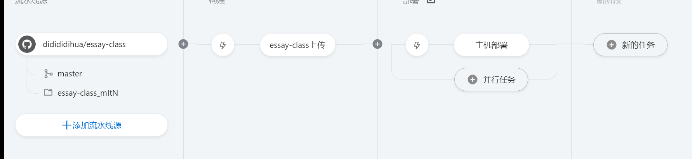

# 爬取文章与归档功能

> 
> 本项目是用于完成[程序员鱼皮](https://github.com/liyupi) 提出的导入[编程导航知识星球](https://yupi.icu)所有文章且按标签分层归类的功能
> 在springboot-init项目基础上完成

> 作者：didididi (1514176166@qq.com)
```yaml
clone本项目 : git clone -b master https://github.com/didididihua/essay-class.git
github : https://github.com/didididihua/essay-class/tree/master
```

## 项目添加功能简介：
* **1.标签数据获取：**
  * 获取编程导航分享文章是可使用的标签，且按照获取到的数据进行了分层构造，存入数据库，其数据展示是树状的标签数据
  * 在项目启动时执行一次任务，进行标签数据的获取与入库
  * 使用redis缓存其树状数据，提高响应效率
  * 使用Redisson分布式锁防止缓存击穿问题
  * 刷新获取标签数据时，使用延迟双删对redis的数据进行更新
* **2.文章数据获取：**
  * 提供一个进行一次文档的全量获取的请求（不算全量，只是一次获取较多文章）
    * 使用自定义线程池进行多线程并发获取，较快效率
  * 之后使用每分钟一次的定时任务进行增量获取文章数据
* **3.文章数据的归档：**
  * 使用标签数据表与文章数据表的多对多关系，构建一张标签与文章的中间表 `post_label`
  * 在构建文章post对象时同时构建其与标签的关系对象，一同进行批量插入
    * 维护了一个使用单例的map（双检锁），便于有标签名获取到对应的标签list
* **4. 小小反爬设置(定时任务爬取时使用)**
  * 设置REFERER
  * 设置USER_AGENT
  * 使用了ip池进行动态代理ip设置：
    * 使用jsoup从快代理网站的html数据，得到一些高匿ip,形成ip池
    * 使用代理的请求会进行一定次数的失败重试（简单for循环，嘿嘿）
  * 编程导航的html数据应该要使用Selenium去模拟浏览器解析js数据得到吧
* **5. 关于CI/CD**
  * 使用assembly插件进行打包，配置好运行脚本，这样能打包出一个bin目录，里面包含这启动这个项目的运行脚本
  * 使用阿里云云效的流水线进行简单的CI/CD

### 简图：




### 效果简图：


## 项目启动：
> 本项目运行在有Maven与JDK8及以上的环境下
### 1. 更改配置:
* **导入数据库sql:**
  * 直接使用本项目sql文件夹中的api_db_sql.sql文件进行数据导入即可
* **更改数数据库配置:**
```yaml
spring:
  datasource:
  driver-class-name: com.mysql.cj.jdbc.Driver
  url: jdbc:mysql://localhost:3306/diso_db
  username: xxxx # 你的mysql的用户名称
  password: xxxx # 你的mysql的密码
```
* **该功能需要使用redis,所以更改redis的配置:**
```yaml
spring:
  redis:
    database: 1
    host: xxx.xxx.xxx.xxx # 运行redis的主机ip
    port: xxxx # redis使用的端口
    timeout: 5000
    password: xxxxx # redis的密码
```
* 在项目启动后会运行 `PostLabelData` 类中设置的任务(进行一次导入标签数据的任务)，若停止后在其启动本项目，请将其关闭，
  * 关闭:
  取消@Compoent的注释，将其作为bean注入注入到ioc中即表示在启动本项目时运行设定好的一次任务
```java
  //@Component
  @Slf4j
  public class PostLabelData implements CommandLineRunner {
    ...
  }
```


启动项目，访问 `http://localhost:8101/api/doc.html` 即可打开接口文档，不需要写前端就能在线调试接口了~

